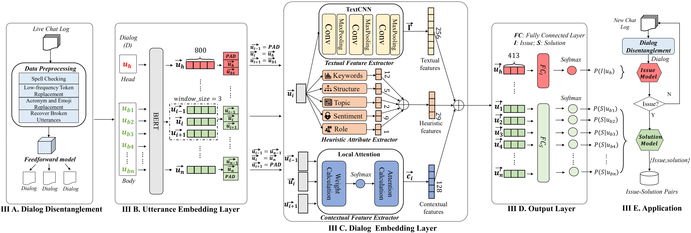
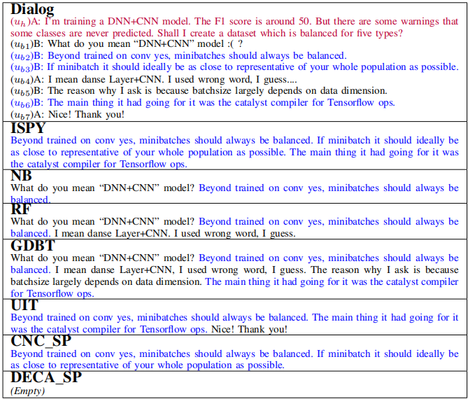
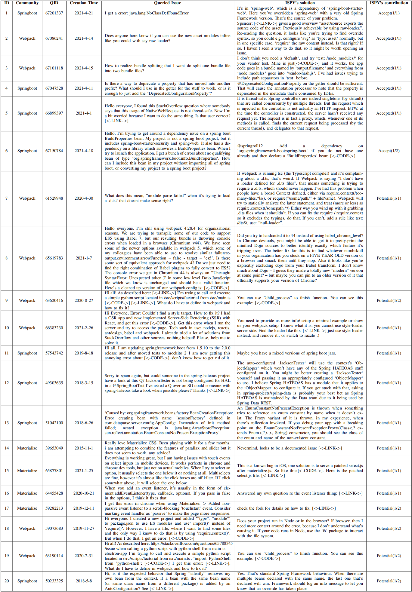

# ISPY
This is a replication package for "Automated Issue Detection and Solution Extraction".

Our project is public at:
[https://gitlab.com/ispy2021/ispy-master](https://gitlab.com/ispy2021/ispy-master).

## Content
[1 Project Structure](#1-project-structure) 
[2 Project Summary](#2-project-summary) 
[3 Models](#3-models) 
[4 Experiment](#4-experiment) 
&ensp;&ensp;[4.1 Baselines](#41-baselines) 
&ensp;&ensp;[4.2 Our Dataset](#42-our-dataset) 
[5 Results](#5-results) 
&ensp;&ensp;[RQ1: Issue Detection](#51-rq1-issue-detection) 
&ensp;&ensp;[RQ2: Solution Extraction](#52-rq2-solution-extraction) 
&ensp;&ensp;[RQ3: Component Analysis](#53-rq3-component-analysis) 
[6 Application](#6-application) 

## 1 Project Structure
The replication package includes three part:
 
- Code: [features](./features) and [models](./models)
- Dataset: [data](./data)
- Model: [sota_model](./sota_model)

## 2 Project Summary
Community live chats contain rich sets of information for potential improvement on software quality and productivity. One of the important applications is to mine knowledge
on issues and their potential solutions. However, it remains a
challenging problem to accurately mine such knowledge.
In this paper,
we first formulate the problem of issue-solution pair extraction from developer live chat data and propose an automated approach named ISPY. Specifically, ISPY automates three tasks: 
(1) Disentangle live chat logs; 
(2) Detect dialogs discussing issues; 
(3) Extract appropriate utterances and combine them as corresponding solutions.

## 3 Models
The model of diagram is available at [diagram](./diagrams). The structure is shown as follow:
<!--  -->

 

I. The _Dialog Disentanglement_ first uses the pipeline of data preprocessing, i.e., spell checking, low-frequency token replacement, acronym and emoji replacement, and broken utterance removal. Then we choose the SOTA model
[irc-disentanglement](https://github.com/jkkummerfeld/irc-disentanglement/zipball/master) to seperate the whole chat log into independent dialogs with reply-to relationships, which is also available in [disentanglement](./disentanglement).

II. The _Dialog Embedding Layer_ has three extractors. (1) Textual Feature Extractor: To learn basic textual features for each utterance, we first represent utterances by using **TextCNN**. (2) Heuristic Attribute Extractor: The heuristic attribute extractor aims to augment the dialog embedding results. (3) Contextual Feature Extractor: Contextual feature extractor aims to embed the contextual information for each utterance with the **Local Attention** mechanism.

&ensp;&ensp;a. The heuristic feature extraction (_Heuristic Attribute Extractor_) is available in [features](./features).

&ensp;&ensp;b. The other components (_Textual Feature Extractor_ & _Contextual Feature Extractor_) and layers are available in [models](./models)

III. The _Utterance Embedding Layer_ aims to not only encode textual information of
utterances but also capture their contextual information with **BERT**. The _Output Layer_ aims to predict the possibility of issue-solution detection. Both layers are available in [models](./models)

## 4 Experiment
We propose 3 RQs in our paper, which is related to our experiment:

- RQ1 (Issue Detection): What is the performance of ISPY in detecting issue dialogs from live chat data?
- RQ2 (Solution Extraction): What is the performance of ISPY in extracting solutions for a given issue?
- RQ3 (Component Analysis): How does each individual component in ISPY contribute to the overall performance?

### 4.1 Baselines
For RQ1, we compare our ISPY with common baselines: i.e., Naive Bayesian (NB), Random Forest (RF), and Gradient Boosting Decision Tree (GBDT); additional baselines: i.e., Casper, CNC_PD, and DECA_PD.

For RQ2, we compare our ISPY with common baselines: i.e., Naive Bayesian (NB), Random Forest (RF), and Gradient Boosting Decision Tree (GBDT); additional baselines: i.e., UIT, CNC_SP, and DECA_SP.

We present the link of these additional baselines for reference. 

- Casper: [https://hguo5.github.io/Caspar](https://hguo5.github.io/Caspar)
- CNC: [https://github.com/tkdsheep/IntentionMining-TSE](https://github.com/tkdsheep/IntentionMining-TSE)
- DECA: [http://www.ifi.uzh.ch/seal/people/panichella/tools/DECA.html](http://www.ifi.uzh.ch/seal/people/panichella/tools/DECA.html)
- UIT: [https://github.com/prdwb/UserIntentPrediction](https://github.com/prdwb/UserIntentPrediction)

For RQ3, we compare ISPY with its three variants: (1) ISPY-CNN, which removes the textual feature extractor from ISPY, (2) ISPY-Heu, which removes the heuristic attribute extractor from ISPY, and (3) ISPY-LocalAttn, which removes the contextual feature extractor from ISPY. Three variants use the same parameters when training.
### 4.2 Our Dataset
The scale of our dataset is available as follows. 
The entire chat dataset includes **`1,402,894`** utterances of the eight Gitter communities, from Angular to Typescript. Sampled chat dataset includes sampled disentangled dialogs, where **`171`** are issue dialogs and **`579`** are non-issue dialogs.

 

You can download the entire and sampled dataset with the following links.

| **ID** | **Project (Entire)** | **Entire Size(kb)**     | **Download (Entire)** | **Project (Sample)** | **#Sampled Dialogs** | **Download (Sampled)** |
| :----:| :----:| :----: | :----: | :----: | :----: | :----: |
|P1| Angular | 87,629 | [Download](https://github.com/LiveChat2021/LiveChat/blob/main/data/raw/angular_angular_chatFormat.ascii.txt?raw=true) | Angular | 97 | [Download](https://raw.githubusercontent.com/LiveChat2021/LiveChat/main/data/manual/angular.txt) |
|P2| Appium | 3,475 | [Download](https://github.com/LiveChat2021/LiveChat/blob/main/data/raw/appium_appium_chatFormat.ascii.txt?raw=true) | Appium | 87 | [Download](https://raw.githubusercontent.com/LiveChat2021/LiveChat/main/data/manual/Appium.txt) |
|P3| Deeplearning4j | 36,458 | [Download](https://github.com/LiveChat2021/LiveChat/blob/main/data/raw/eclipse_deeplearning4j_chatFormat.ascii.txt?raw=true) | Deeplearning4j | 93 | [Download](https://raw.githubusercontent.com/LiveChat2021/LiveChat/main/data/manual/dl4j.txt) |
|P4| Docker | 3,543 | [Download](https://github.com/LiveChat2021/LiveChat/blob/main/data/raw/docker_docker_chatFormat.ascii.txt?raw=true) | Docker | 94 | [Download](https://raw.githubusercontent.com/LiveChat2021/LiveChat/main/data/manual/docker.txt) |
|P5| Ethereum | 7,858 | [Download](https://github.com/LiveChat2021/LiveChat/blob/main/data/raw/ethereum_welcome_chatFormat.ascii.txt?raw=true) | Ethereum | 100 | [Download](https://raw.githubusercontent.com/LiveChat2021/LiveChat/main/data/manual/ethereum.txt) |
|P6| Gitter | 1,894 | [Download](https://github.com/LiveChat2021/LiveChat/blob/main/data/raw/gitter_gitter_chatFormat.ascii.txt?raw=true) | Gitter | 86 | [Download](https://raw.githubusercontent.com/LiveChat2021/LiveChat/main/data/manual/Gitter.txt) |
|P7| Nodejs | 11,029 | [Download](https://github.com/LiveChat2021/LiveChat/blob/main/data/raw/nodejs_node_chatFormat.ascii.txt?raw=true) | Nodejs | 95 | [Download](https://raw.githubusercontent.com/LiveChat2021/LiveChat/main/data/manual/nodejs.txt) |
|P8| Typescript | 22,532 | [Download](https://github.com/LiveChat2021/LiveChat/blob/main/data/raw/Microsoft_Typescript_chatFormat.ascii.txt?raw=true) | Typescript | 98 | [Download](https://raw.githubusercontent.com/LiveChat2021/LiveChat/main/data/manual/Typescript.txt) |
 

## 5 Results

### 5.1 RQ1: Issue Detection
The results of issue's baseline comparison is shown as follow:

<!--  -->

 

The table demonstrates the comparison results between the performance of ISPY and those of the six baselines across data from eight OSS communities, for issue detection tasks. 

Overall, ISPY significantly (p-value<0.05) outperforms the six baselines in terms of the average Precision, Recall, and F1 score. Specifically, when comparing with the best Precision-performer among the six baselines, i.e., RF, ISPY can improve its average precision by 19%. Similarly, ISPY improves the best Recall-performer, i.e. GBDT, by 0.07 for average recall, and improves the best F1-performer, i.e. GBDT, by 0.30 for average F1 score. At the individual project level, ISPY can achieve the best performances in most of the eight communities. These results indicate that ISPY can more accurately detect whether a dialog is discussing issues, than all comparison baselines. 

| **Answering RQ1: ISPY outperforms the six baselines in detecting issue dialogs across most of the studied projects, and the average Precision, Recall, and F1 are 80%, 72%, and 76% respectively, improving the best F1-baseline GBDT by 30% on average F1 score.** |
| :-----|
### 5.2 RQ2: Solution Extraction
The results of solution's baseline comparison is shown as follow:

<!--  -->

 

The table summarizes the comparison results between the performance of ISPY and those of
the six baselines across data from eight OSS communities for solution extraction task.

ISPY can achieve the highest performance in most of the columns. It significantly (p-value<0.05) outperforms the six baselines. On average, although ISPY is slightly below GBDT by 3% of Recall, it reaches the highest F1 score (63%), improving the best baseline RF by 20%. It also reaches the highest precision (68%), significantly higher than other baselines (i.e., ranging from 17% to 37%). These results imply that ISPY can effectively extract utterances as the corresponding solutions from development dialogs.
<!--  -->

 

The table presents the example of solution extraction via different baselines and ISPY, which can be compared with ground truth solution results through the color of utterances.
This example shows that ISPY has these two advantages:

1) Our approach is sensitive to identifying solutions including consecutive utterances by employing the local attention mechanism.
2) Our approach can screen negative feedbacks in consecutive utterances and reject ineffective solutions based on the heuristic attributes (i.e., disapproval keywords and negative sentiment attributes) and local attention mechanism.

| **Answering RQ2: ISPY outperforms the six baselines in extracting solution utterances in terms of Precision and F1. The average Precision, Recall, and F1 are 68%, 59%, and 63% respectively, improving the best F1-baseline RF by 20% on average F1 score.** |
| :-----|
### 5.3 RQ3: Component Analysis
The figure presents the performances of ISPY and its three variants respectively. The F1 performances of ISPY are higher than all three variants in both issue-dialog detection and solution extraction tasks.

 

The top three charts in the figure compare the precision, recall, and F1-score of ISPY and its three variants, for the issue-detection task. Compared to ISPY-Heu and ISPY-CNN, ISPY has moderately better precision and F1, and the recalls of all three remain very close.

The bottom three charts in Fig. 3 compare the precision, recall, and F1-score of ISPY and its three variants, for the solution-extraction task. Compared to ISPY-Heu and ISPY-CNN, ISPY has moderately better precision, recall, and F1.

<!--  -->

 

The table of component analysis shows that ISPY mostly captures the correct solution extraction via three feature extractors, but three removals all lead to the bad classification after testing. Moreover, the removal of LocalAttn causes the most significant misclassifications.

| **Answering RQ3: The textual feature extractor, heuristic attribute extractor, and content feature extractor adopted by ISPY are helpful for extracting issue-solution pairs, while the contextual feature extractor provides a more significant contribution to the effectiveness of ISPY than others.** |
| :-----|

## 6 Application
Apart from the existing 8 communities and 8 projects, we test our model on three new communities with the following procedures.

1) First, we crawl the recent (January 2018 to April 2021) live chats of three new communities: Materialize, Springboot, and WebPack (note that these are different from our studied communities).
2) Second, we apply ISPY to disentangle the live chats into about 21K dialogs, and generate a dataset with over 9K issue-solution pairs.
<!--  -->

 

 

The table shows that 26 sampled different test QID and the acceptance of ISPY solutions. ISPY can expedite the resolving process of the “BuildProperties” issue by providing a workable solution.

All of our publicated issue-solution pairs includes ISPY-extracted after dialog disentanglement and model prediction. Over **`30K`** issue-solution pairs are extracted from 11 communities.
 
| **Project**  | Angular                                                                                          | Appium                                                                                          | Deeplearning4j                                                                                | Docker                                                                                          | Ethereum                                                                                          | Gitter                                                                                          | Nodejs                                                                                          | Typescript                                                                                          | Springboot                                                                                          | Webpack                                                                                             | Materialize                                                                                         |
|--------------|--------------------------------------------------------------------------------------------------|-------------------------------------------------------------------------------------------------|-----------------------------------------------------------------------------------------------|-------------------------------------------------------------------------------------------------|---------------------------------------------------------------------------------------------------|-------------------------------------------------------------------------------------------------|-------------------------------------------------------------------------------------------------|-----------------------------------------------------------------------------------------------------|-----------------------------------------------------------------------------------------------------|-----------------------------------------------------------------------------------------------------|-----------------------------------------------------------------------------------------------------|
| **Dialogs**  | 6.6K                                                                                               | 1.4K                                                                                              | 9.8K                                                                                            | 2.2K                                                                                              | 3.4K                                                                                               | 1.0K                                                                                              | 4.3K                                                                                              | 5.7K                                                                                                  | 6.5K                                                                                                  | 8.2K                                                                                                  | 7.5K                                                                                                  |
| **Download** | [Download](https://gitlab.com/ispy2021/ispy-master/-/raw/master/data/result_data/angular_ispair.txt) | [Download](https://gitlab.com/ispy2021/ispy-master/-/raw/master/data/result_data/appium_ispair.txt) | [Download](https://gitlab.com/ispy2021/ispy-master/-/raw/master/data/result_data/deeplearning4j_ispair.txt) | [Download](https://gitlab.com/ispy2021/ispy-master/-/raw/master/data/result_data/docker_ispair.txt) | [Download](https://gitlab.com/ispy2021/ispy-master/-/raw/master/data/result_data/ethereum_ispair.txt) | [Download](https://gitlab.com/ispy2021/ispy-master/-/raw/master/data/result_data/gitter_ispair.txt) | [Download](https://gitlab.com/ispy2021/ispy-master/-/raw/master/data/result_data/nodejs_ispair.txt) | [Download](https://gitlab.com/ispy2021/ispy-master/-/raw/master/data/result_data/typescript_ispair.txt) | [Download](https://gitlab.com/ispy2021/ispy-master/-/raw/master/data/proposed_data/springboot_ispair.txt) | [Download](https://gitlab.com/ispy2021/ispy-master/-/raw/master/data/proposed_data/webpack_ispair.txt) | [Download](https://gitlab.com/ispy2021/ispy-master/-/raw/master/data/proposed_data/materialize_ispair.txt) |
